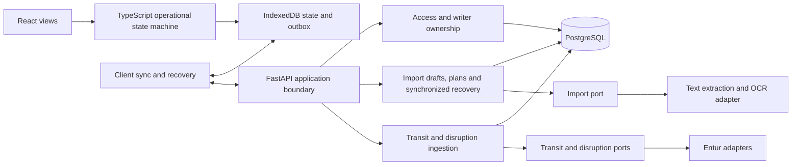
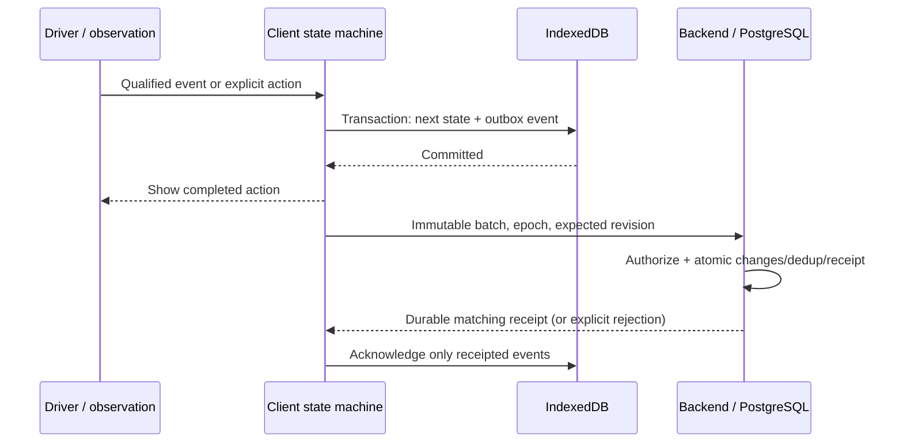
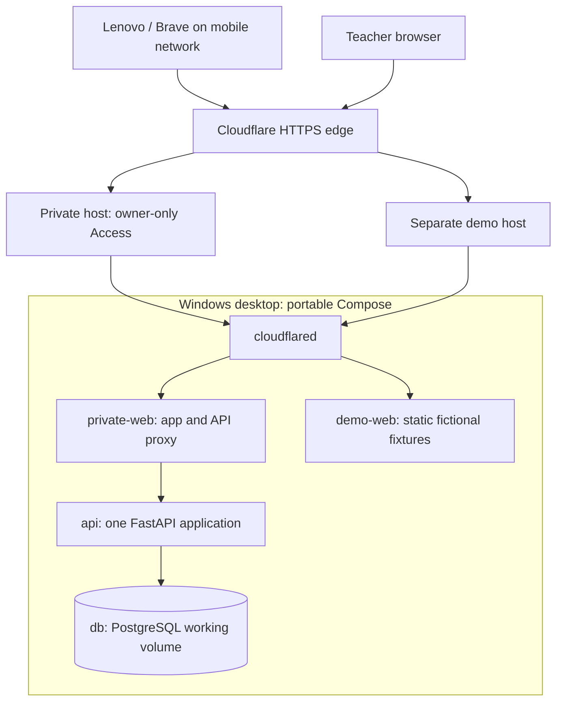

# Architecture Spine — IBE160 Bus Driver Assistant

## Design Paradigm

**Modular monolith with ports and adapters at real external boundaries.** One web client, one backend application and one PostgreSQL database. The client owns the active day's operational decisions; the backend owns access, external source ingestion and synchronized history. This document binds independently implemented capabilities; detailed fields, tables and file structure belong to stories and code.

Authority: the approved Product Brief, PRD and UX documents listed above, amended by the user's adopted AD-1–AD-14 decisions in the [decision log](.memlog.md). Explicit later corrections supersede older source wording. [EXPERIENCE.md](../../ux-designs/ux-IBE160-2026-09-22/EXPERIENCE.md) governs interaction and lifecycle details; [DESIGN.md](../../ux-designs/ux-IBE160-2026-09-22/DESIGN.md) governs presentation. Brief rationale is included for the owner, implementing agents and technical course readers.

**V1 boundary:** generic image/PDF shift import with human confirmation; own and linked-person plans; whole-day preparation; stop progression and manual correction; qualified disruption display; driver, FADDER and INSTRUKTØR contexts; offline execution, summary and local PDF export; private pilot access and a fictional demo. Tromsø and lines 20, 24, 28 and 42 are pilot configuration/data. Tide Selfservice, NVDB, DATEX, weather, speed limits, meeting buses and calculated deadhead routes are not V1 integrations. Tour/charter workflows, cross-account collaboration and permanent driving archives are outside V1.

## Invariants & Rules

### AD-1 — Modular boundaries [ADOPTED]

**Binds:** backend modules, client domain and external adapters. **Prevents:** vendor/location coupling and speculative infrastructure. **Rule:** place ports at the import, transit-data and disruption-data boundaries V1 actually uses. Keep ordinary internal logic direct; dependencies point from adapters/UI toward application/domain contracts, never from domain logic toward React, FastAPI or provider payloads. The backend is one deployable application. Do not build interfaces for hypothetical integrations. Configuration selects pilot area and source identifiers; the domain does not assume Tromsø, Tide or an Entur-backed passenger trip for every future activity. **Why:** clear external seams allow later operators/sources without distributing this small application.

### AD-2 — Local operational authority [ADOPTED]

**Binds:** client persistence, UI completion and synchronization. **Prevents:** lost acknowledged actions and network-dependent driving. **Rule:** commit each operational change and its outbox event together in IndexedDB before showing completion. React renders committed state. Service Worker/Cache Storage holds verified nonpersonal application assets; IndexedDB holds private working data. Browser storage is evictable, never guaranteed durable.

Show separate readiness for the confirmed plan, required downloaded day data and complete application assets; identify missing content. A confirmed, prepared day supports operation, correction, restart, summary and local PDF export offline. New imports and previously undownloaded data may require a connection. One client controls an active day; offline competing clients cannot physically be prevented from changing state and must be reconciled explicitly. Neither synchronization nor source refresh silently overwrites manual corrections or explicit driver choices. **Why:** the active client must remain operational when the host or mobile connection fails.

### AD-3 — React/TypeScript and Python/FastAPI [ADOPTED]

**Binds:** runtime boundaries and API contracts. **Prevents:** duplicate operational engines and accidental starter scope. **Rule:** React/Vite with TypeScript in the browser; Python/FastAPI in the modular backend. The single operational state machine stays in TypeScript. FastAPI owns explicit request/response validation and OpenAPI; generate TypeScript API types/client at build time where useful. Generated types do not replace backend validation.

Use the official React/Vite starter as a small frontend seed. The official Full Stack FastAPI template is a reference for useful build, test and OpenAPI setup, not an adopted application: do not inherit public registration, its authentication design, admin UI or unnecessary deployment services. **Why:** this follows the course book's strong Python-backend/JavaScript-frontend direction without claiming it is a confirmed assessment requirement.

### AD-4 — PostgreSQL [ADOPTED]

**Binds:** durable backend storage and integration tests. **Prevents:** production/test differences in transactions, locking and constraints. **Rule:** PostgreSQL 18 in development, pilot and integration tests. Enforce ownership, uniqueness, revisions and atomic writes in the database; use typed bounded JSON only where appropriate. No SQLite substitute for integration evidence. **Why:** synchronization and writer transfer require dependable relational transactions; the pilot does not need distributed storage.

### AD-5 — Contracts and atomic synchronization [ADOPTED]

**Binds:** six conceptual contracts and all state-changing API clients. **Prevents:** incompatible identities, replay loss and partial acceptance. **Rule:** use the contract and envelope conventions below. `OperationalState` is primarily local: send typed events and only the checkpoint/state information the backend needs for synchronization and recovery, never require the entire local model on every change.

The backend authorizes identity/day scope and checks expiry before deduplication. Authorized retrieval of an existing receipt is read-only and does not require the original writer epoch to remain current; new mutations require current writer authority and expected revision. Atomically commit domain changes, event/batch deduplication, receipt and the next server revision. A valid identical retry returns its original receipt, including when its expected revision has since advanced; idempotency never bypasses authorization/expiry. Reusing an ID with different content is rejected. Rejections produce no partial domain writes. Keep one stable batch in flight per day; clear only events acknowledged by a matching receipt and retry the same immutable batch after an uncertain response, subject to AD-12 payload deletion. Conflicts preserve local unsynchronized work for explicit resolution. External polling has separate source/version state and never increments the operational revision or overwrites corrections. **Why:** lost responses and retries must not duplicate or erase work.

### AD-6 — Reviewed import and transient originals [ADOPTED]

**Binds:** import adapter, draft UI and processing storage. **Prevents:** unreviewed plan changes and raw-file retention. **Rule:** extract text/OCR inside the backend behind the import port. Qualify pdfplumber and Tesseract on representative anonymized shifts before locking them; render every relevant scanned PDF page to an image before OCR. Interpretation produces an editable `ImportDraft` with uncertainty and provenance. Failures still permit manual entry/correction; only explicit confirmation changes a plan.

Persist interpreted fields, uncertainty and corrections so drafts resume after reload. The original preview does not persist: explain that the file must be selected again. Browser originals remain transient; no raw files in IndexedDB, Service Worker caches, logs or persistent processing queues. Delete backend originals and processing copies when interpretation finishes, fails or is cancelled; cleanup must also cover interrupted processes. Qualify temporary-storage/swap behavior. Keep necessary extracted fields, not a raw OCR archive. **Why:** recoverable editing does not require keeping private source documents.

### AD-7 — Prepared transit data and qualified disruption ingestion [ADOPTED]

**Binds:** source adapters, trip matching and offline bundles. **Prevents:** incomplete days, invented route precision and per-driver polling. **Rule:** use targeted Entur API queries to prepare the whole confirmed day and persist available trips/stops/times. A journey planner's optimized suggestions are not a complete trip catalogue. Automatically link only evidence-supported unique matches; ambiguous matches require a choice, unmatched items remain explicitly unresolved. Never silently change confirmed plans.

Entur SIRI SX/TRO is a **candidate**, not verified full Svipper coverage. Poll centrally per source/pilot area, initially around two minutes, respecting provider limits. Persist source cursor/baseline state and distinguish empty changes, a complete confirmed absence of active notices, partial results and fetch failure. Resolve pagination before asserting completeness. Qualify IDs, actual coverage, frequency, updates and endings on pilot data. If API day preparation proves insufficient, revisit bulk NeTEx/GTFS rather than building both pre-emptively.

Notice relevance must be supported by source references. Preserve original source links/identifiers for the source action. Line/stop/direction evidence and uncertain links remain distinguishable. Roadworks text alone cannot establish precise relevance to the bus's road trajectory. Coverage, freshness and match confidence are separate facts. Failed retrieval retains previous notices marked potentially stale; without any successful retrieval, coverage is unknown. **Why:** useful information must remain honest about what the sources actually support.

### AD-8 — Notice versions and lifecycle [ADOPTED]

**Binds:** backend notice normalization and client presentation/history. **Prevents:** stale resurrection, false closure and lost updates. **Rule:** backend owns source facts/status; client owns day-specific seen, acknowledged/registered and hidden state for the exact version the driver saw. Material content or relevance changes produce an updated, unread version even when the previous version was hidden. Identical content or a new fetch time does not; a local context switch alone is not a new source version. Updates are silent. New relevant notices may use only the UX-approved new-notice sound; replay/context changes do not.

Distinguish confirmed closure, expired validity and uncertain disappearance. A missing notice in an incomplete response never proves closure. Older source versions cannot resurrect a closed notice; content fingerprints are not source ordering. Handle sparse closure messages and multiple validity periods. Confirmed closure immediately removes active warnings and stop markers; show a struck-through overview entry for ten minutes from the client's first persisted registration of closure, without resetting on reload, then retain only summary history until expiry. Acknowledgement reduces prominence, not the relevance of an otherwise active stop marker. **Why:** source lifecycle and what the driver has seen evolve independently.

### AD-9 — One operational state machine [ADOPTED]

**Binds:** progression, movement restrictions, role/context and recovery. **Prevents:** UI-dependent transitions and false GPS certainty. **Rule:** one React-independent TypeScript state machine consumes the stop sequence, qualified observations and explicit actions. Assess position and speed quality separately, including age, accuracy and plausible sequence. Schedule or proximity alone never proves passage/departure. Manual choices remain authoritative; persist recovery evidence without a permanent GPS track. Restored observations are not fresh observations.

The ≤100 m target is distance travelled after actual passage/departure, to be verified in the field, not a radius that proves passing. Tune numeric quality/progression thresholds on Lenovo/Brave. If precision/frequency is inadequate, show uncertain progression and manual correction; do not claim the target is met.

Carry these UX invariants into the state machine:

- Unknown speed is never 0. Reliable movement above 0 restricts driver interaction to the approved heading view. The genuine initial-startup exception lasts only until the first valid speed; subsequently missing speed, even after 0, uses the five-minute exception. Persist that history/outage timing across reload. No accelerometer dependency. Theme controls remain available; GPS-loss previous/next-stop correction remains available as specified, including in motion. Network loss is not GPS loss.
- FADDER/INSTRUKTØR are private operational contexts. Persist role, selected person/plan/context and pinned trip atomically; pinning belongs to that person/block/activity. Confirmed context change ends that context without completing/aborting its trip. Linked plans belong to the same account, never cross-account sharing. Acute takeover applies driver restrictions without losing guiding context or pinning; returning to guidance is explicit. Instructor blocks and own trips retain their distinct plan ownership.
- Passenger trips finish at the registered final stop, including a manual registration with its provenance. Ordinary transition follows the ten-second `Siste stopp` state. Same-route returns wait for qualified start-stop evidence or the specified extra manual Next action during GPS loss. Non-passenger completion uses location/time evidence with uncertainty and explicit summary confirmation where needed.
- Missing stop lists first trigger timetable recovery, then `Stoppinformasjon mangler` with automatic stop progression disabled. Permit manual completion/abortion and next-activity selection under interaction rules, without inventing a final-stop ID or GPS evidence.
- Ending/aborting a day is explicit and terminal. The initial completion review may settle uncertain summary entries; later access is read/export, never resume.

**Why:** all screens, offline recovery and the fictional demo must apply the same operational rules. Detailed interaction rules remain in EXPERIENCE.md.

### AD-10 — Bounded access and active-day continuation [ADOPTED]

**Binds:** application sessions, day grants, logout and demo isolation. **Prevents:** a session timeout stopping an authorized day or authorizing a new one. **Rule:** provision the pilot account; no public registration. Use password hashing/rate limiting and an opaque server-managed session identifier in a host-only `Secure`, `HttpOnly`, explicit `SameSite=Lax` cookie. Protect writing requests, including login/logout, with CSRF and exact-origin controls. Web and API share an origin.

Ordinary access expires at `app_authenticated_at + 14 days`, without polling-based renewal. During authorized preparation, bind a day grant to the owner, client and concrete day; its deadline is bounded by the then-confirmed planned final end plus seven days. After ordinary expiry it permits continuation only of that **already active** day, never starting a prepared/new day. Preserve a browser credential capable of identifying that grant after day 14: cookie lifetime may cover the latest valid scope, but cookie presence does not confer general access.

After end/abort, allow only bounded completion review and outstanding synchronization until the earliest of the day-grant deadline, actual end plus seven days and data expiry. Extending authority requires fresh application authorization, not clock changes. Received logout/revocation invalidates the server session and grants; account revocation invalidates all affected sessions.

Offline logout immediately persists a local lock and pending server revocation. Show that server logout is pending; send it before other private traffic when the app can actually reach the server. Retain unsynchronized work within its deletion deadline; only a fresh app login by the same owner can recover it after pending logout is settled. Known revocation locks locally; disconnected clients cannot instantly learn remote revocation. Local locking is not encryption against someone controlling the browser profile; use the device/OS lock.

The public demo has its own origin, fictional fixtures and storage, no private backend access or private credentials. **Why:** a bounded day exception preserves continuity without becoming an indefinite session.

### AD-11 — Writer transfer and explicit conflict resolution [ADOPTED]

**Binds:** tabs/devices, synchronization and takeover. **Prevents:** stale takeover snapshots and silent loss of offline changes. **Rule:** Web Locks coordinates tabs on one origin; backend `writer_epoch` and revisions enforce control between devices. Missed heartbeats/timeouts never automatically transfer ownership.

Planned handover: old client stops new changes and drains synchronization; backend atomically increments `writer_epoch` and returns the post-transfer server revision. In that transaction, rebind the day grant to the new authenticated client/session and retire the former client's day grant, preserving existing deadlines; any extension requires separate renewed authorization under AD-10. New client loads or verifies recovery state and day data against that revision before controlling the day. Previously downloaded state is insufficient without verification. Handover retries/status lookup must tolerate lost responses.

Emergency takeover requires an explicit same-owner authenticated action showing the last server-received timestamp/revision and possible missing old-device work; transfer epoch and day-grant authority atomically under the same deadline rule. The returning old client preserves its pending events for review, stops acting as writer once it learns of takeover, and never automatically submits them under the new epoch. Review local work against server state; chosen corrections become new events under the current authority, never altered old batches. Explicitly applied/discarded conflict copies remain subject to deletion. **Why:** two offline writers are possible; their work cannot safely be merged by arrival order.

### AD-12 — Visible retention and accepted loss risk [ADOPTED]

**Binds:** all private data copies, exports, expiry guards and operations. **Prevents:** indefinite hidden retention and expired-day resurrection. **Rule:** an unconfirmed import draft expires seven days after creation, non-sliding, or earlier with its associated day. Confirmation removes redundant draft copies. Derived day data expires seven days after confirmed actual end/abort; if never ended, use the planned final end. Only a confirmed plan revision can change an unended day's planned end. This is one combined-day clock; viewing, synchronization, export and refresh never restart it.

Display deadlines, especially for drafts and unsynchronized work. Deletion includes private information in older revisions, checkpoints, outboxes, conflict copies, receipts, grants and summaries. At own-day end, retain only actually accompanied evidence from linked plans; remove the remainder from all copies.

If this trimming affects pending payloads, the local closing transaction preserves permitted final facts and unsynchronized corrections in one minimal, trimmed recovery checkpoint, deletes prohibited payloads and retires affected original batch/event identities. Retirement is not acknowledgement; retain only permitted checkpoint content and payload-free identity/hash/status metadata within the existing deadline. Use an authorized payload-free receipt/status lookup to resolve whether original batches committed. Verify the server revision against known receipts; unexplained changes require AD-11 resolution.

Submit the closure checkpoint with new batch/event IDs: it records the retained result rather than replaying retired effects. In one transaction, check current writer/expected revision, preserve existing receipts, fence still-unaccepted retired IDs, accept the checkpoint, close the day and remove prohibited linked data. A delayed original request either committed before this transaction or is fenced afterward; terminal-state validation also bars resurrection under fresh IDs. Already accepted originals return their authorized prior receipt; fenced unaccepted batches return `batch_retired`. Stale epoch/revision preserves the local checkpoint for explicit review. Lost settlement responses retry its unchanged new IDs/payload; never revive retired payloads or extend deadlines.

Backend expiry checks deny access/export/synchronization independently of idempotent startup/periodic purging. Clients check on startup, resume and while running, before displaying/sending expired work. An offline client may not re-upload an expired day. A closed browser cannot run an exact-time purge; on return it deletes before use. Remote earlier endings become known on reconnect, without creating a new grace period.

No historical backups, snapshots or archived WAL containing private shift data in V1. Keep PostgreSQL's working volume and ordinary transaction/recovery machinery; logical deletion is not a claim of forensic erasure. Permanent data loss after device/volume failure is an accepted pilot limitation. Exported user PDFs lie outside automatic cleanup. Never put private payloads, originals, credentials or GPS tracks in logs, repository, images or CI artifacts. Public source cache/account settings have separate lifecycles and must not hide private day associations. **Why:** the pilot prioritizes short, inspectable retention over historical disaster recovery.

### AD-13 — Desktop hosting, Cloudflare and portable delivery [ADOPTED]

**Binds:** ingress, private/demo isolation, access readiness and host operations. **Prevents:** public private-data exposure and a second access clock silently defeating AD-10. **Rule:** first host is the owner's Windows desktop using Docker Desktop Linux containers and portable Compose. One named Cloudflare Tunnel routes a stable private hostname and a separate fictional-demo hostname; reject unmatched routes. Domain/account/owner email are provisioning choices, not provisioned resources.

Protect the entire private host, including `/api`, with an owner-only Cloudflare Access application **before** publishing its route, plus the independent app login. Email OTP is the minimal candidate, restricted to the owner's explicit identity. Enforce the expected Access application JWT at the private tunnel route and validate signature/issuer/audience/expiry before backend use of its claims. No exposed pilot database/API/HTTP host ports, browser service tokens, expiry bypasses or demo relay. Host-only cookies, exact-origin/CSRF checks and no credentialed demo-to-private CORS remain necessary even for sibling subdomains.

Start with a one-month Access application/policy session and compatible global identity session; avoid hidden shorter overrides. At authorized preparation, inspect the **actual verified token expiry** against the bounded day grant including settlement and a tested clock margin. If insufficient, guide Access renewal and recheck the returned token. Separate offline data readiness, credential lifetime coverage and current connectivity; none promises a whole day online. Access renewal never extends app access, creates a day grant, starts a new day or changes writer authority. [Access session model](https://developers.cloudflare.com/cloudflare-one/access-controls/access-settings/session-management/).

Access expiry/failure pauses source updates and synchronization while an already authorized prepared day continues locally. Show the access/freshness problem. No forced login navigation while driving. HTML login/redirects, unexpected content types and CORS/network failures are not receipts or application-shell assets. Renew deliberately when interaction permits. Logout sends app revocation before Access logout; if the gate blocks a pending offline logout, renew Access while locally locked, then revoke before other private traffic. Access login alone never unlocks retained work.

Cloudflare terminates browser TLS and handles private uploads; it is part of the trust boundary. Bypass edge caching for the private host; private/API/auth responses use `no-store`; disable private archival/body capture. Verify provider logging/upload handling before real files: local deletion does not establish provider erasure. If AD-6/AD-12 cannot be met, revisit the access route, with Tailscale as the fallback. [Tunnel model](https://developers.cloudflare.com/tunnel/).

Use versioned images, environment configuration, external secrets and named volumes without hardcoded Windows paths. Long-running services use `unless-stopped`, database/schema readiness and runtime reconnect; health checks alone do not restart a stuck process. Central polling/cleanup resumes with stored source state. Bound CPU/memory, run one OCR job at a time, avoid continuous builds/watchers and qualify acceptable desktop noise. Keep the host awake; a locked screen is fine.

After a full Windows reboot, user sign-in before Docker Desktop starts is an accepted first-pilot limitation. Test service restart after sign-in. An acquired Linux host can later use tested boot-managed startup; a paid server remains a fallback, neither is required now. Preserve the browser origin on migration and never run independent operational databases behind one live route. Host/home-network failure invokes prepared-day offline behavior. **Why:** ordinary-browser tablet/teacher access is possible with the available desktop and a later portable host choice.

### AD-14 — Coherent releases through data expiry [ADOPTED]

**Binds:** browser boot/cache, schemas, backend compatibility and rollback. **Prevents:** mixed builds and destructive update recovery. **Rule:** separate build ID, API/event schema versions, local storage schema and domain revisions. Pin release artifacts/dependencies. Schedule ordinary releases between days after checking pending work; completely stage/validate a successor before user-accepted activation.

Persist the active day's required build and retain its complete verified asset set. Closing all tabs can activate a waiting Service Worker: installation/activation therefore does **not** authorize switching that day's app or schema. Boot routing must restore one coherent version, including while offline or Access has expired. If required files are missing, report a clear error through a minimal recovery path and preserve private data; never run a random old/new mix or clear storage to repair it. Browser eviction remains possible. [Service Worker lifecycle](https://web.dev/articles/service-worker-lifecycle).

A new backend must support the retained client's required API contract through the affected data's actual expiry: immutable event formats, responses/errors, recovery/day data, notice updates and access/logout operations. Compatibility is not merely the last two releases or seven days after deployment. New clients must recover retained drafts/history/pending work. An upgrade may be required before authorizing a new day, not to revoke an existing day's continuation.

Use versioned transactional migrations where possible and tested recovery for multi-step exceptions. Coordinate tabs/workers; preserve manual choices, role/context/pin, notice-version states, immutable outbox IDs/payloads, pending logout, writer epochs, uncertainty and deadlines. Blocked/failed migrations preserve data and any usable compatible build. Code rollback requires storage compatibility; no automatic destructive downgrade or historical-private-backup escape. Keep V1 to one active build and a staged successor normally, with additional code/format retention only when existing work requires it. **Why:** offline working state outlives a deployment and may be the only surviving copy.

## Consistency Conventions

| Conceptual contract | Owner and boundary |
| --- | --- |
| `ImportDraft` | Backend interpretation; editable, resumable client/server draft with uncertainty and corrections. Confirmation is explicit. |
| `Workday / PlanRevision` | Confirmed own/linked plans and revision scope. Name the target plan and match only within it; affected accompaniment links remain unresolved rather than silently relinked. Combined day, driver shift, trip, vehicle duty and physical bus remain distinct; imported `Vogn` is not automatically a bus number. Partial/additive imports cannot imply deletion of absent activities or overwrite performed/manual work. |
| `OperationalState` | Client state machine; backend receives only necessary events/checkpoints for recovery, not the full model on each action. |
| `NoticeVersion / SourceStatus` | Canonical source identity/version, lifecycle, evidence and freshness; client per-version interaction state is separate. |
| `OfflineBundle` | Revisioned whole-day data manifest; identifies available/missing requirements and the plan/source versions it covers. |
| `SyncBatch / SyncReceipt` | Atomic immutable event submission and durable acknowledgement under day, client, epoch and expected revision. |

Use opaque UUIDs for workday, plan, activity/tracking context, client, batch and event IDs. Derive owner from authenticated authority, never trust a submitted owner field. Namespace external IDs by source. Keep monotonic `plan_revision`, operational `server_revision` and backend `writer_epoch` separate from source version identifiers.

Batch minimum: `schema_version`, `batch_id`, `workday_id`, `client_id`, `writer_epoch`, `expected_revision`, and ordered typed events with `event_id`, `client_sequence`, `occurred_at` and necessary payload. A receipt identifies the accepted batch/events, resulting revision and server receipt time. Cross-batch event deduplication must not apply an event twice. No generic event-sourcing framework is required.

Use UTC ISO timestamps for instants; local `service_date` plus IANA time zone for schedule interpretation, with explicit dates across midnight. Ambiguous input stays unresolved for correction. Separate source update time (nullable), source fetch/last-success time, client receipt time and server receipt time. Client clock order never wins conflicts by itself.

| API outcome | Required behavior |
| --- | --- |
| `accepted`, `already_applied` | Matching durable receipt; acknowledge only its events. |
| 409 `revision_conflict`, `writer_conflict`, `idempotency_key_reused`, `batch_retired` | Preserve permitted local work; stop affected synchronization; follow AD-11 or AD-12 closure settlement. Retirement is not acknowledgement. |
| 422 `invalid_payload`, `unsupported_schema` | No partial mutation; preserve local input. |
| 401 `authentication_required`; 403 `access_denied` | Apply scope/lock rules; no automatic outbox deletion. Outer Access may instead return a redirect/network failure. |
| 410 `workday_expired` / `workday_gone` | No recreation or re-upload; apply retention after authorized existence handling. |

Detailed DTO fields, endpoints, indexes and tables are story-level work within these boundaries.

## Stack

Cold-start seed, checked 2026-09-23; repository lockfiles/images become the executable version record. Refresh compatible patches at bootstrap, without silently changing these boundaries.

| Name | Version | Role / evidence |
| --- | --- | --- |
| React | 19.3.0 | UI; [official versions](https://react.dev/versions). |
| Vite / TypeScript | 8.3.0 / 6.0.2 | Frontend build seed from [create-vite 9.2.1 React/TS template](https://github.com/vitejs/vite/blob/create-vite%409.2.1/packages/create-vite/template-react-ts/package.json); generator version is distinct from Vite. |
| Node.js | 24.21.0 LTS | Frontend build tooling, not a second backend; [releases](https://nodejs.org/en/blog/release). |
| Python / FastAPI | 3.14 baseline / 0.141.1 | Backend; [template baseline](https://github.com/fastapi/full-stack-fastapi-template), [FastAPI release](https://github.com/fastapi/fastapi/releases/tag/0.141.1). |
| PostgreSQL | 18 (18.6 seed) | Working database and integration tests; [supported versions](https://www.postgresql.org/support/versioning/). |
| cloudflared | 2026.9.1 | Tunnel connector; [release](https://github.com/cloudflare/cloudflared/releases/tag/2026.9.1). |

Docker Compose is the portable deployment description; Cloudflare Access/Tunnel are managed services. Pin actual images and runtime tooling during bootstrap. OCR candidates checked: pdfplumber 0.11.10 and Tesseract 5.5.3; their adoption remains conditional on AD-6 qualification. No ORM, migration library, static web server or API client generator is locked by this spine. [FastAPI client generation](https://fastapi.tiangolo.com/advanced/generate-clients/).

## Structural Seed

Only the client state machine decides live progress. Backend recovery is the last accepted synchronized state, not a competing live GPS engine. Adapter results enter through validated canonical contracts. Modules own their writes; calls across modules follow these contracts rather than independently editing another module's tables. Shared in-process deployment does not remove ownership boundaries.

Compose has five services: `cloudflared`, `private-web`, `demo-web`, `api`, `db`. Limit Docker networks so demo cannot reach API/database and the connector reaches only intended ingress services. The demo shares operational rules, with simulated position/speed and repeatable notice/network/GPS failure scenarios; label the simulation and its exports. It never shares private configuration/data/storage. Use fictional fixtures for automated development/tests; qualify anonymized imports separately. Target-device development needs browser-trusted HTTPS for secure browser APIs. No live tunnel, DNS, app code or deployment is created by this architecture workflow.

Before real-shift pilot use, require recorded evidence for these release gates:

| Gate | Required evidence |
| --- | --- |
| Import and sources | Representative anonymized text/scanned PDFs and images, all relevant pages, failed OCR/manual fallback and crash cleanup; actual automatic Entur/Svipper-origin retrieval, day completeness, matching, SX/TRO coverage/IDs/pagination/rate limits, updates and endings. Manual/demo notices cannot satisfy retrieval acceptance; missing source coverage remains visible and may block the intended pilot capability. |
| Operational device behavior | Lenovo/Brave GPS accuracy/frequency, ≤100 m progression target, speed unknown/loss recovery and five-minute rule, final-stop/return cases, role/context switching and explicit corrections. Mounted-tablet readability, contrast, responsive fit and touch/glove checks from DESIGN remain unproven by static mocks. No assumed background-tracking guarantee. |
| Durability and recovery | Transaction failure before UI completion, offline reload and full-day use, lost receipt/idempotent retry, two-client conflicts/planned/emergency transfer, expiry of every copy and rejection of late uploads; real PostgreSQL integration tests. |
| Access and deployment | App day-14 expiry with valid active-day grant; Access short lifetime/renewal/expiry, HTML auth replies and blocked offline logout; private/demo isolation; mobile trusted HTTPS; Windows reboot before/after sign-in, resource/noise measurements and home-network failure/recovery. |
| Releases | Old client/new backend through data expiry; close/reopen while update waits, both offline and Access-expired; missing/partial assets; blocked/interrupted migrations and second tabs; preserved pending logout, immutable batches, deadlines and manual choices. |

These are required future tests, not claimed results. Documentation research established feasibility candidates; hardware inventory did not establish usable GPS, coverage, quiet hosting or successful deployment.

## Deferred

- **Story design:** concrete fields/tables/endpoints, lightweight migration/OCR scheduling tools, schema-compatibility adapters, manifest/cache boot implementation, numeric quality thresholds and automation tools. Resolve before implementing the affected contract; retain the six boundaries and all adopted invariants.
- **Qualification choices:** lock OCR tooling after representative-file evidence; approve Entur day-query/SX coverage after pilot-data evidence; choose any bulk fallback only if API qualification fails. Inadequate GPS requires honest uncertainty/manual behavior, not a fabricated success claim. A material capability gap returns to an explicit product/architecture decision.
- **Provisioning:** owned domain, Cloudflare account/email policy, secrets, provider logging verification and measured resource limits before real private use. Test the accepted Windows sign-in recovery limitation. Linux or paid hosting is revisited if desktop availability/noise is impractical; Tailscale if Cloudflare access/retention requirements cannot be met.
- **Later extensions:** Tide Selfservice only if authorized access becomes available; other operators/areas and NVDB/DATEX/weather/speed-limit/meeting-bus data through real external boundaries when selected. No speculative implementation, premature interface set or hardcoded pilot domain assumptions.
- **Delivery capacity:** prioritize and estimate the approved scope during Epics & Stories. This architecture does not establish that the full V1 fits a particular course-hour budget. Critical security changes incompatible with an active build require an explicit controlled recovery/stop decision, never an undisclosed forced update.
